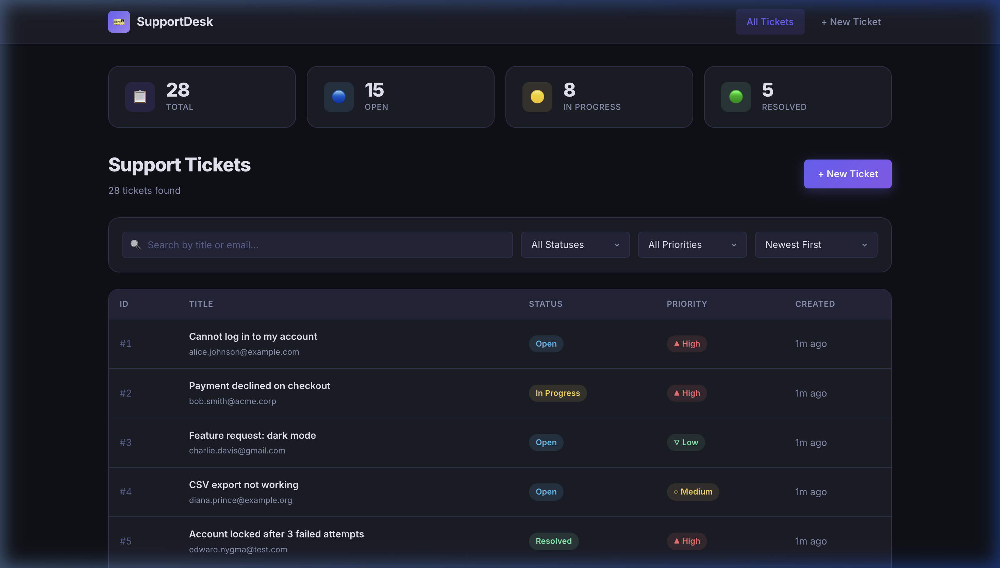
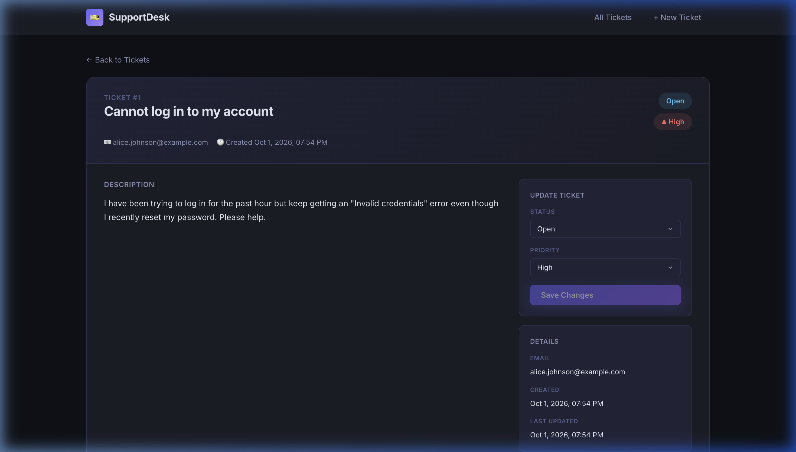
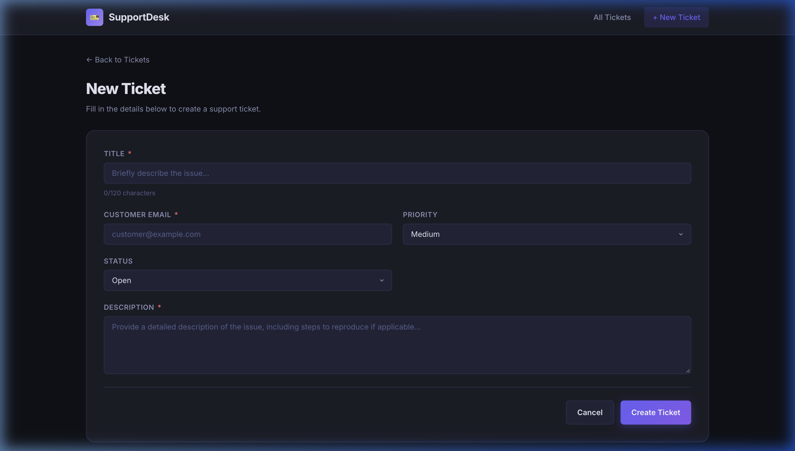

# Support Ticket Dashboard

A full-stack web application for managing customer support tickets. Built with **Vue 3**, **Express**, and **SQLite**.

---

## Screenshots

| Ticket List | Ticket Detail | Create Ticket |
|:-----------:|:-------------:|:-------------:|
|  |  |  |

---

## Tech Stack

| Layer | Technology |
|-------|-----------|
| Frontend | Vue 3 + Vue Router + Vite |
| Backend | Node.js + Express |
| Database | SQLite (via `better-sqlite3`) |
| Validation | `express-validator` (backend) + custom (frontend) |
| Testing | Jest + Supertest |

---

## Project Structure

```
SupportTicketDashboard/
├── backend/
│   ├── data/               # SQLite database files (auto-created)
│   ├── scripts/
│   │   └── seed.js         # Seed 28 demo tickets
│   ├── src/
│   │   ├── app.js          # Express app factory
│   │   ├── db/
│   │   │   ├── database.js         # DB connection (lazy singleton)
│   │   │   └── ticketRepository.js # All SQL queries
│   │   ├── middleware/
│   │   │   └── validate.js  # express-validator error handler
│   │   ├── routes/
│   │   │   └── tickets.js   # All ticket API endpoints
│   │   └── tests/
│   │       └── tickets.test.js  # 22 automated tests
│   ├── server.js           # Entry point
│   └── package.json
├── frontend/
│   ├── src/
│   │   ├── api.js          # Centralized API client
│   │   ├── utils.js        # Formatting helpers
│   │   ├── assets/
│   │   │   └── style.css   # Global design system
│   │   ├── views/
│   │   │   ├── TicketList.vue   # Home — list, search, filter
│   │   │   ├── TicketDetail.vue # View + edit ticket
│   │   │   └── CreateTicket.vue # Create form
│   │   ├── App.vue
│   │   └── main.js
│   ├── index.html
│   ├── vite.config.js
│   └── package.json
└── README.md
```

---

## Setup Instructions

### Prerequisites

- **Node.js** ≥ 18
- **npm** ≥ 9

### 1. Install Backend Dependencies

```bash
cd backend
npm install
```

### 2. Install Frontend Dependencies

```bash
cd frontend
npm install
```

### 3. Seed the Database

```bash
cd backend
npm run seed
```

This inserts 28 demo tickets with varied statuses and priorities. **Re-running the seed command is safe** — it clears existing data first.

### 4. Start the Servers

**Terminal 1 — Backend API (port 3000):**
```bash
cd backend
npm start          # or: npm run dev   (uses --watch for auto-reload)
```

**Terminal 2 — Frontend (port 5173):**
```bash
cd frontend
npm run dev
```

Open **http://localhost:5173** in your browser.

> The Vite dev server proxies all `/api` requests to `http://localhost:3000`, so no CORS configuration is needed.

---

## Environment Variables

| Variable | Default | Description |
|----------|---------|-------------|
| `PORT` | `3000` | Backend server port |
| `DB_PATH` | `backend/data/tickets.db` | Absolute path to SQLite database file. Used by tests to point to an isolated test DB. |

---

## Running Tests

```bash
cd backend
npm test
```

**22 tests** covering:
- `POST /api/tickets` — all validation rules (required fields, email format, max length, enum values, defaults)
- `GET /api/tickets` — pagination, status filter, priority filter, search by title, search by email, sort order, invalid query params
- `PATCH /api/tickets/:id` — status update, priority update, 404 for missing ticket, validation errors
- `GET /api/tickets/summary` — aggregate count shape
- `GET /api/tickets/:id` — single ticket retrieval, 404
- Unknown route — 404

Each test run creates an isolated `data/test_tickets.db` file and deletes it on completion.

---

## API Reference

### `GET /api/tickets`
List tickets with optional filtering, searching, sorting, and pagination.

**Query Parameters:**

| Param | Type | Description |
|-------|------|-------------|
| `search` | string | Search title or email (LIKE) |
| `status` | string | `Open`, `In Progress`, or `Resolved` |
| `priority` | string | `Low`, `Medium`, or `High` |
| `sort` | string | `asc` or `desc` (by `created_at`) |
| `page` | integer | Page number (default: 1) |
| `limit` | integer | Per-page count (default: 10, max: 100) |

**Response:**
```json
{
  "data": [ ... ],
  "pagination": { "total": 28, "page": 1, "limit": 10, "totalPages": 3 }
}
```

### `GET /api/tickets/summary`
Returns total count and per-status breakdown (unaffected by filters).

```json
{ "total": 28, "open": 15, "in_progress": 8, "resolved": 5 }
```

### `GET /api/tickets/:id`
Returns a single ticket. `404` if not found.

### `POST /api/tickets`
Create a ticket.

**Body:**
```json
{
  "title": "Cannot log in",          // required, max 120 chars
  "description": "...",              // required
  "email": "user@example.com",       // required, valid email
  "priority": "High",               // optional, default: Medium
  "status": "Open"                   // optional, default: Open
}
```

**Returns:** `201 Created` with the created ticket.

### `PATCH /api/tickets/:id`
Update `status` and/or `priority`. At least one field is required.

**Error Response Shape (422):**
```json
{
  "error": "Validation failed",
  "details": [
    { "field": "email", "message": "Customer email must be a valid email address." }
  ]
}
```

---

## Technical Choices & Assumptions

### Why SQLite?
Zero infrastructure — no database server to install or configure. `better-sqlite3` provides synchronous, transaction-safe operations that pair well with Express. Suitable for the team size and load implied by the problem statement.

### Why Vue 3 + Vite?
Lightweight, fast, and familiar. Vite's proxy feature eliminates all local CORS friction during development.

### Why Express?
Minimal, battle-tested, and easy to understand for any Node.js developer extending the codebase.

### Repository Layer
All SQL is encapsulated in `ticketRepository.js`. Routes remain thin and only handle HTTP concerns. This makes the business logic independently testable.

### Lazy DB Singleton
`database.js` defers opening the SQLite file until the first query. This allows the `DB_PATH` environment variable to be set in test files before the module initializes, enabling clean test isolation without mocking.

### Assumptions
- Authentication is out of scope (per spec).
- "Updated timestamps" are handled by a SQLite `AFTER UPDATE` trigger to guarantee they're set even if an ORM or raw SQL statement is used directly.
- The assignment says "filtering, sorting, and pagination must be handled by the backend" — all three are fully server-side.

### Known Limitations
- No real-time updates (polling or WebSockets) — a full-page refresh is needed to see changes made by other users.
- `npm test` requires `BypassSandbox: true` in the Antigravity IDE due to the SQLite native module needing file system access beyond the sandbox.
- The `better-sqlite3` package includes a native add-on that may require a build step (`npm rebuild`) on some systems after `npm install`.

---

## Time Spent

| Phase | Time |
|-------|------|
| Planning, scaffolding, project structure | 20 min |
| Backend API + validation + repository layer | 40 min |
| Database schema + seed data | 15 min |
| Test suite (22 tests) | 25 min |
| Frontend (design system, all views, API client) | 60 min |
| Debugging, testing, polishing | 20 min |
| README | 15 min |
| **Total** | **~195 min (~3.25 hours)** |

---

## AI Tool Usage

This project was built with the assistance of **Google Antigravity (Claude Sonnet 4.6)**. The AI was used to:

- Generate all source files (backend routes, repository, middleware, Vue components, CSS)
- Debug test isolation issues (lazy DB singleton pattern)
- Write the seed data set and full test suite
- Write this README

All code was reviewed, verified against the spec, and tested by running the application and the full test suite. I am prepared to explain any part of the implementation and make live modifications during the interview.
